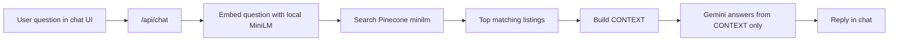
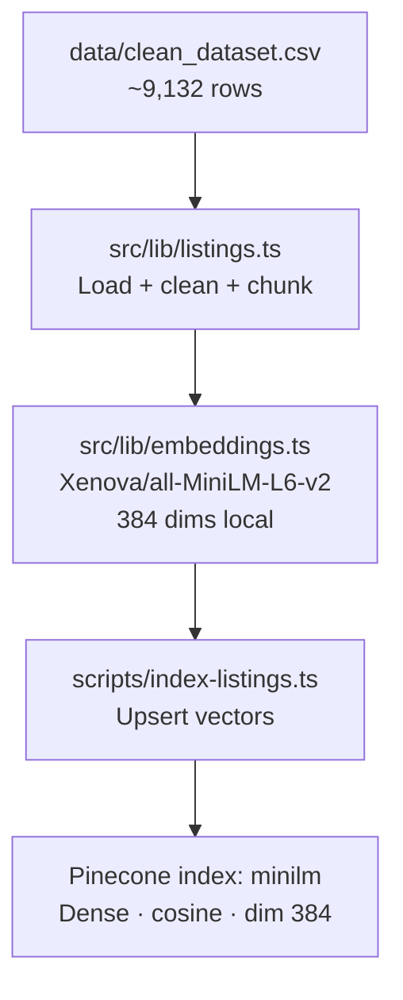
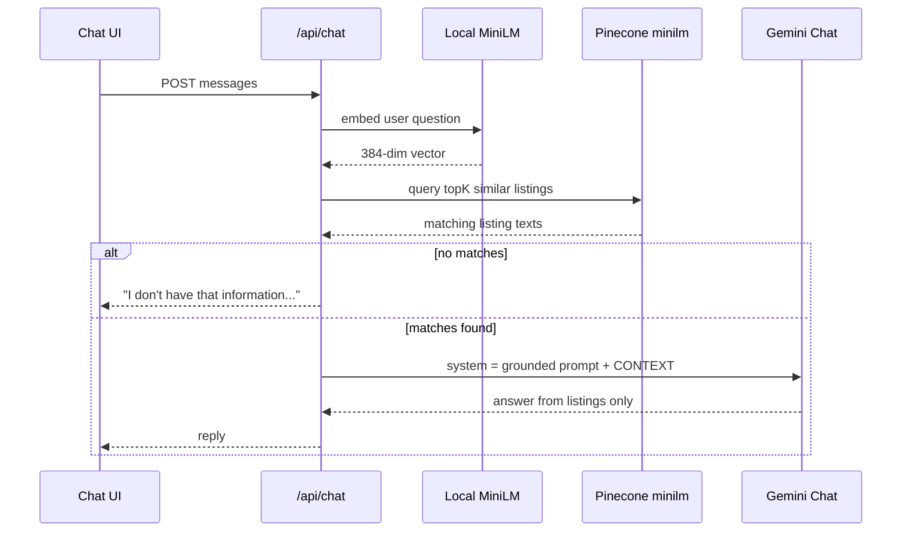
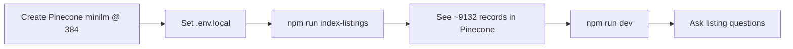

# DBG-AI RAG — What We Built

This document explains the **RAG (Retrieval-Augmented Generation)** setup for DBG-AI: what changed, where files live, how data flows, and what impact it has.

---

## Goal

Make the chatbot answer **only from your Noida listings CSV**, not from Gemini’s general knowledge.

| Before | After |
| --- | --- |
| Gemini answered from training knowledge | Gemini answers from **retrieved listings only** |
| Could invent prices / addresses | Must use CONTEXT; otherwise refuses |
| Gemini embeddings (API quota) | **Local MiniLM** embeddings (no embed quota) |
| Vector DB | Pinecone index **`minilm`** (384-dim) |

---

## Big picture



---

## Two pipelines

### 1) Indexing (run once, or when CSV changes)



Command:

```bash
npm run index-listings
```

No Gemini embedding calls — runs fully on your machine.

### 2) Chat (every user message)



---

## File map

```text
DBG-AI/
├── data/
│   └── clean_dataset.csv          # Source listings
├── scripts/
│   └── index-listings.ts          # MiniLM embed → upsert Pinecone
├── src/
│   ├── app/api/chat/route.ts      # Retrieve → ground → Gemini generate
│   └── lib/
│       ├── listings.ts            # CSV → chunks
│       ├── embeddings.ts          # Local MiniLM (@xenova/transformers)
│       ├── pinecone.ts            # Pinecone client
│       ├── rag.ts                 # Retrieve + grounded prompt
│       └── gemini.ts              # Chat model only
├── .env.example
└── docs/RAG.md
```

| File | Role |
| --- | --- |
| `src/lib/embeddings.ts` | Local `Xenova/all-MiniLM-L6-v2` (384-dim) |
| `scripts/index-listings.ts` | Batch embed + upsert into `minilm` |
| `src/lib/rag.ts` | Query Pinecone, filters, CONTEXT prompt |
| `src/app/api/chat/route.ts` | RAG + Gemini answer |

---

## Environment

```env
GEMINI_API_KEY=...                 # answers only
PINECONE_API_KEY=...
PINECONE_INDEX=minilm
LOCAL_EMBEDDING_MODEL=Xenova/all-MiniLM-L6-v2
EMBEDDING_DIMENSIONS=384
RAG_TOP_K=8
```

Pinecone index settings:

| Setting | Value |
| --- | --- |
| Name | `minilm` |
| Type | Dense |
| Metric | cosine |
| Dimension | **384** |

---

## Setup checklist



---

## Aggregation routing (not vector top-K)

Questions like **highest / lowest / average / count / costliest / largest** skip Pinecone similarity and run on the **full filtered CSV**:

1. Parse filters (sector, BHK, price ceiling)
2. Filter all matching rows
3. Compute max / min / avg / count programmatically
4. Answer with the real extreme value (never a random top-K chunk)

Examples that use this path: `highest price in sector 75`, `cheapest 2bhk in sector 137`, `average price of 3bhk`, `how many 2bhk in sector 75`.

---

## Scoring (tune in `.env.local`)

Pinecone returns a **cosine similarity** (`rawScore`, roughly 0–1).  
You don’t invent that number — you **filter and boost** it:

| Env | Meaning | Default |
| --- | --- | --- |
| `RAG_MIN_SCORE` | Drop hits below this raw similarity | `0.2` |
| `RAG_SECTOR_BOOST` | Add to score when sector matches | `0.2` |
| `RAG_BEDROOM_BOOST` | Add when BHK matches | `0.05` |
| `RAG_FILTER_TOP_K` | Candidates when filters are used | `120` |
| `RAG_TOP_K` | Final listings sent to Gemini | `8` |

Final score ≈ `rawScore + boosts`.

After changing listing metadata fields, run:

```bash
npm run patch-listing-metadata
```

---

## Impact

| Area | Impact |
| --- | --- |
| Embed quota | **None** — local MiniLM |
| Indexing speed | Minutes on laptop for ~9k rows |
| Answer grounding | Still CONTEXT-only via Gemini |
| Chat cost | Gemini generation tokens only |
| Sector / BHK queries | Pinecone metadata filter + score boosts |

---

## Mental model

```text
CSV  ──MiniLM──►  Pinecone minilm (384)
                      ▲
                      │ search
User question ──MiniLM─┘
                      │
                      ▼
              Top listings = CONTEXT
                      │
                      ▼
              Gemini → grounded answer
```
