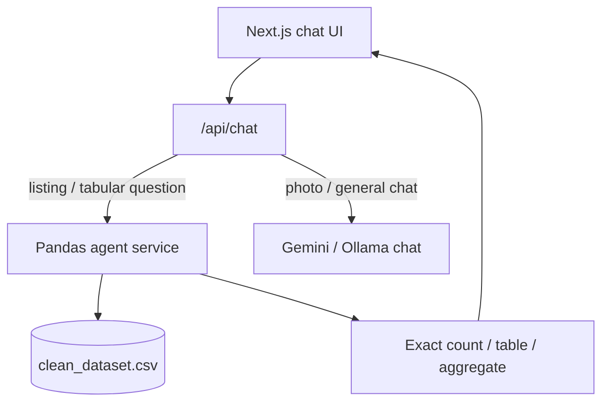

# Architectural Migration Guide: Moving from Vector RAG to Pandas Code-Execution Agent

## Overview

Standard vector embedding RAG systems struggle with tabular data, strict multi-condition filtering, boolean amenity checks, and exact numerical aggregations. To achieve **100% precision** on structured real estate datasets, the system must transition from text-chunk retrieval to a **Python Pandas Code-Execution Agent**.

In DBG-AI today:

| Path | Strength | Weakness on tabular CSV |
| --- | --- | --- |
| **Vector RAG** (Pinecone + MiniLM) | Semantic “find similar listings” | Soft matches; hard AND filters / exact counts are fragile |
| **Deterministic CSV helpers** (`src/lib/rag.ts`) | Exact filters, null counts, aggregates | Every new query shape needs hand-written TypeScript |
| **Vectorless / PageIndex** | Tree reasoning over docs | LLM can still misread pipe-delimited rows |

**LangPanda goal:** keep the Next.js chat UI, but answer listing questions by generating and executing **Pandas code** against `data/clean_dataset.csv` (or an equivalent DataFrame), then return the code result in plain language.

```text
User question
    → LLM writes safe Pandas code
    → Execute against listings DataFrame
    → Return exact rows / counts / aggregates
    → Optional: LLM formats the numeric result as readable text
```

---

## Step 1: Install Required Dependencies

Ensure the environment has the libraries for data manipulation and agent code execution.

```bash
cd "vecrtorless rag"   # or create a dedicated langpanda/ Python env
python -m venv .venv
source .venv/bin/activate   # Windows: .venv\Scripts\activate

pip install pandas langchain langchain-openai langchain-experimental tabulate
```

### Optional (DBG-AI stack alignment)

```bash
# If answers should stay on Gemini instead of OpenAI:
pip install langchain-google-genai

# If you keep LiteLLM / existing PageIndex tooling:
pip install litellm python-dotenv
```

Pin versions in `langpanda/requirements.txt` once the agent is stable.

---

## Step 2: Load the Listings CSV into a DataFrame

Use the same source of truth as Vector RAG: `data/clean_dataset.csv`.

```python
from pathlib import Path
import pandas as pd

CSV_PATH = Path(__file__).resolve().parents[1] / "data" / "clean_dataset.csv"

df = pd.read_csv(CSV_PATH)

# Normalize common boolean amenity columns (True / False / missing)
AMENITY_COLS = [c for c in df.columns if c.startswith("amenities_")]

def to_bool(series: pd.Series) -> pd.Series:
    return (
        series.astype(str)
        .str.strip()
        .str.lower()
        .isin(["true", "1", "yes"])
    )

for col in AMENITY_COLS:
    df[col] = to_bool(df[col])

# Keep numeric columns numeric; coerce errors to NaN (never invent values)
for col in ["price_in_lakh", "size", "carpet_area", "rate", "bedroom", "bathrooms"]:
    if col in df.columns:
        df[col] = pd.to_numeric(df[col], errors="coerce")
```

**Critical column semantics (do not swap):**

| Column | Meaning |
| --- | --- |
| `price_in_lakh` | Total property price (lakh) |
| `rate` | ₹ per sqft (already per-sqft — never divide again) |
| `size` | Overall size (sqft) |
| `carpet_area` | Carpet area only |
| `amenities_*` | Boolean flags — True only when cell is true/1/yes |

---

## Step 2: Implement the Pandas Agent (`agent.py`)

Create the execution script so the LLM can run programmatic queries on the dataset.

```bash
cd langpanda
uv venv .venv && uv pip install --python .venv/bin/python -r requirements.txt

# Needs OPENAI_API_KEY (gpt-4o) or GEMINI_API_KEY in repo .env.local
.venv/bin/python agent.py
# or:
.venv/bin/python agent.py "How many sector 75 listings have amenities_swimming_pool == True?"
```

Files:

| File | Role |
| --- | --- |
| [`agent.py`](./agent.py) | LangChain Pandas agent + `query_real_estate_agent()` |
| [`dataframe.py`](./dataframe.py) | Load/normalize `clean_dataset.csv` (booleans + numerics) |

---

## Step 3: Create a Pandas Code-Execution Agent (detail)

### 3.1 OpenAI-style (LangChain experimental)

```python
from langchain_openai import ChatOpenAI
from langchain_experimental.agents import create_pandas_dataframe_agent

llm = ChatOpenAI(model="gpt-4o-mini", temperature=0)

agent = create_pandas_dataframe_agent(
    llm,
    df,
    verbose=True,
    agent_type="openai-tools",
    allow_dangerous_code=True,  # required for Python REPL tool; sandbox in production
    prefix=(
        "You analyze a Noida real-estate DataFrame named `df`.\n"
        "CRITICAL RULES:\n"
        "1. Never confuse `rate` (₹/sqft) with `price_in_lakh` (total price).\n"
        "2. Boolean amenities: filter with `df[col] == True` only. "
        "Exclude False and NaN/missing.\n"
        "3. Multi-condition queries use AND across all filters.\n"
        "4. Never invent missing numbers. Use NaN checks.\n"
        "5. Return complete human-readable answers, not raw row indexes alone.\n"
        "6. Counts with amenities must not equal the full location size "
        "unless every row truly matches.\n"
    ),
)
```

### 3.2 Gemini-style (preferred for DBG-AI)

```python
import os
from langchain_google_genai import ChatGoogleGenerativeAI
from langchain_experimental.agents import create_pandas_dataframe_agent

llm = ChatGoogleGenerativeAI(
    model=os.environ.get("GEMINI_MODEL", "gemini-2.0-flash"),
    google_api_key=os.environ["GEMINI_API_KEY"],
    temperature=0,
)

agent = create_pandas_dataframe_agent(
    llm,
    df,
    verbose=True,
    allow_dangerous_code=True,
    prefix="(...same CRITICAL RULES as above...)",
)
```

### 3.3 Example queries the agent should nail

```python
agent.invoke(
    "How many properties in sector 75 have amenities_swimming_pool == True?"
)
# Expect exact count (e.g. 243), NOT 260 (full sector size).

agent.invoke(
    "Top 2 highest price_in_lakh in sector 75. "
    "Show bedroom, price_in_lakh, size, rate separately."
)

agent.invoke(
    "Average rate (₹/sqft) for 2 BHK in sector 75. "
    "Do not use price_in_lakh as rate."
)
```

---

## Step 4: Wire the Agent into DBG-AI (API path)

### Target architecture



### Suggested layout

```text
langpanda/
  README.md                 ← this guide
  requirements.txt
  service/
    app.py                  ← FastAPI: POST /pandas-chat
    dataframe.py            ← load + normalize CSV
    agent.py                ← create_pandas_dataframe_agent
  scripts/
    smoke_test.py           ← assert amenity counts ≠ location totals
```

### Minimal FastAPI endpoint

```python
# langpanda/service/app.py (sketch)
from fastapi import FastAPI
from pydantic import BaseModel
from .agent import get_agent

app = FastAPI(title="DBG-AI LangPanda")

class AskBody(BaseModel):
    question: str

@app.post("/pandas-chat")
def pandas_chat(body: AskBody):
    agent = get_agent()
    result = agent.invoke(body.question)
    # LangChain returns {"output": "..."} for many agent types
    answer = result["output"] if isinstance(result, dict) else str(result)
    return {"reply": answer, "source": "pandas-agent"}
```

### Next.js routing (`src/app/api/chat/route.ts`)

When the question looks tabular (count, max/min, amenity boolean, top-N, average):

1. Prefer **LangPanda** (`LANGPANDA_SERVICE_URL`) over Pinecone retrieval.
2. Fall back to existing `formatAggregateAnswer` / CSV helpers if the service is down.
3. Keep Vector RAG only for fuzzy “find me something like…” browse queries.

Env sketch:

```bash
# .env.local
LANGPANDA_SERVICE_URL=http://127.0.0.1:8770
LANGPANDA_ENABLED=1
```

---

## Step 5: Safety — Code Execution Guardrails

`allow_dangerous_code=True` runs model-generated Python. Harden before production:

1. **Sandbox** — run the REPL in a subprocess with no network, read-only FS except the CSV.
2. **Allowlist imports** — only `pandas`, `numpy`, `math`; block `os`, `subprocess`, `socket`.
3. **Timeout + row caps** — kill runs over N seconds; truncate displayed rows (e.g. top 50).
4. **Read-only DataFrame** — agent works on a copy; never write back to `clean_dataset.csv`.
5. **Audit log** — store generated code + result for every chat turn.

For early demos, local-only + trusted operators is acceptable; do not expose the REPL publicly without a sandbox.

---

## Step 6: Migration Checklist (Vector RAG → LangPanda)

- [ ] **Step 1** — Install Pandas + LangChain experimental deps in a dedicated venv.
- [ ] **Step 2** — Load `data/clean_dataset.csv` with typed numerics and boolean amenities.
- [ ] **Step 3** — Create `create_pandas_dataframe_agent` with DBG-AI critical rules in `prefix`.
- [ ] **Step 4** — Expose `/pandas-chat` and call it from `/api/chat` for tabular questions.
- [ ] **Step 5** — Add smoke tests:
  - Sector amenity count **&lt;** sector total when some amenities are False.
  - `rate` answers in thousands of ₹/sqft, not tiny quotients of `rate/size`.
  - `carpet_area` queries never substitute `size`.
  - Top-N lists return **N** complete human-readable rows.
- [ ] **Step 6** — Keep Pinecone Vector RAG as optional “semantic browse” mode in the UI.
- [ ] **Step 7** — Document operator runbook in this folder; link from root `README.md` and `docs/RAG.md`.

---

## Step 7: What Stays vs What Moves

| Capability | Keep in TypeScript (`rag.ts`) for now | Move to LangPanda |
| --- | --- | --- |
| Exact sector / BHK / price filters | ✅ already good | ✅ also expressible in Pandas |
| Amenity `== True` counts | ✅ recently hardened | ✅ first-class in Pandas |
| Null / NaN column counts | ✅ | ✅ `isna().sum()` |
| Semantic “cozy 3BHK near metro” | Vector RAG | Optional hybrid |
| Ad-hoc SQL-like questions | ❌ brittle | ✅ agent generates code |
| Photo / general advice | Gemini chat | Unchanged |

---

## Step 8: Smoke-Test Script (example)

```python
# langpanda/scripts/smoke_test.py
from service.dataframe import load_listings_df
from service.agent import get_agent

df = load_listings_df()
sector = df["address"].str.contains("sector 75", case=False, na=False)
total = int(sector.sum())
with_pool = int((sector & (df["amenities_swimming_pool"] == True)).sum())
assert with_pool < total, "Amenity True count must not equal full location size"

agent = get_agent()
out = agent.invoke(
    "How many listings in sector 75 have amenities_swimming_pool = True?"
)
print(out)
```

---

## References inside this repo

- Current Vector RAG docs: [`docs/RAG.md`](../docs/RAG.md)
- Listing loaders / filters: [`src/lib/listings.ts`](../src/lib/listings.ts), [`src/lib/rag.ts`](../src/lib/rag.ts)
- Data rules (rate vs price, boolean amenities): [`src/lib/data-rules.ts`](../src/lib/data-rules.ts)
- CSV: [`data/clean_dataset.csv`](../data/clean_dataset.csv)
- Vectorless / PageIndex Python service: [`vecrtorless rag/`](../vecrtorless%20rag/)

---

## Next implementation slice

When you are ready to code (not only document):

1. Add `langpanda/requirements.txt` + `service/dataframe.py` + `service/agent.py`.
2. Run smoke tests on sector 75 amenity counts.
3. Point `/api/chat` tabular branch at `LANGPANDA_SERVICE_URL`.
4. Add a UI mode toggle: **Vector RAG | Vectorless | Pandas Agent**.
